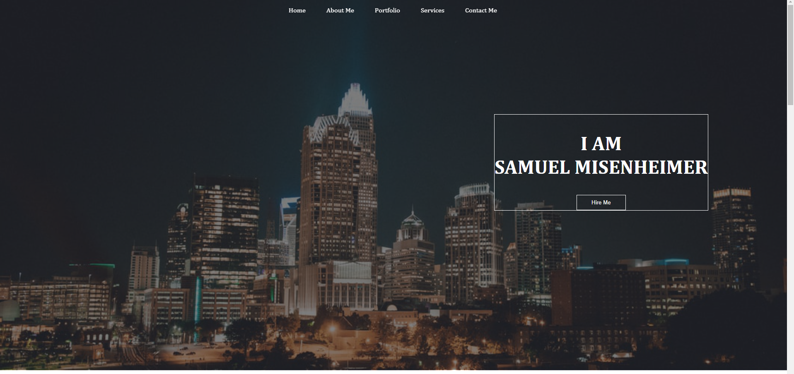
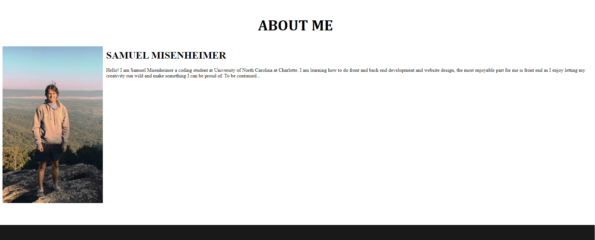
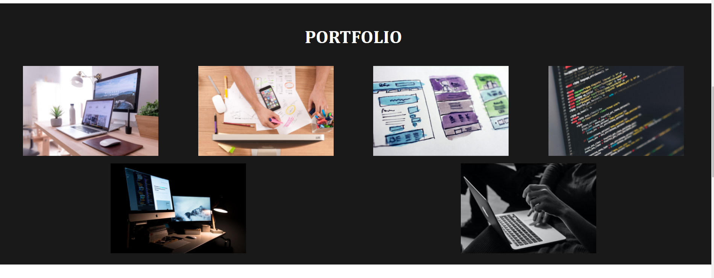
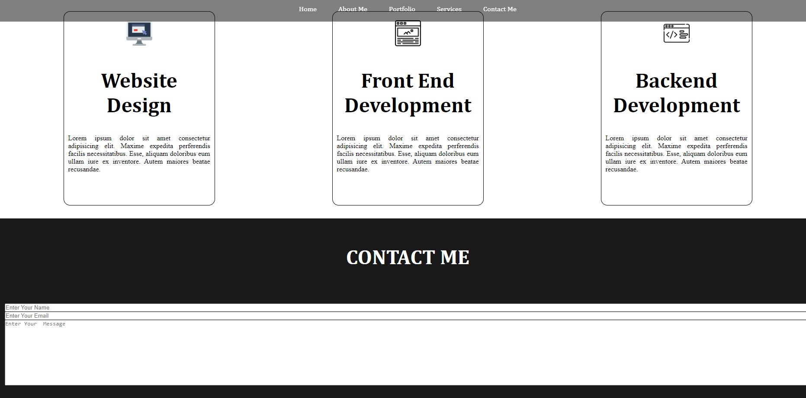

# Samuel-Misenheimer-Portfolio

## Link to the project
https://samz1n.github.io/Samuel-Misenheimer-Portfolio/

## Goals for the Project
* Present my name, a recent photo and links in the navbar to various sections.
* Make the links in the navbar scroll to the corresponding section.
* UI scrolls to a section with previous work (currently untitled example work as I dont have much to show here yet.)
* Automatically resize the website to fit various devices.
* Make a contact section where the user can type responses.

